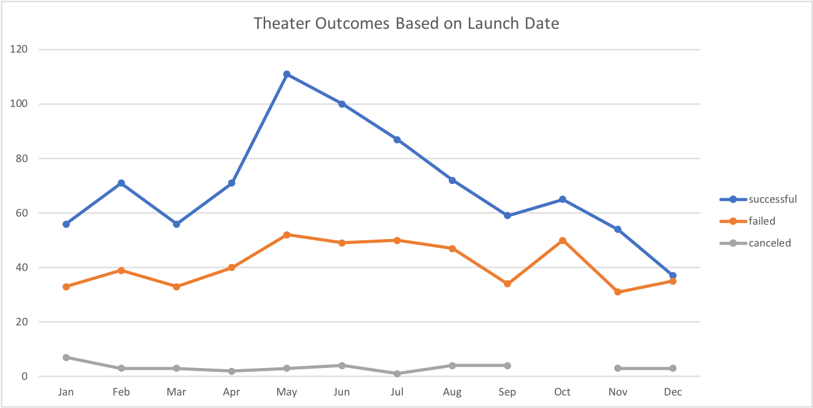
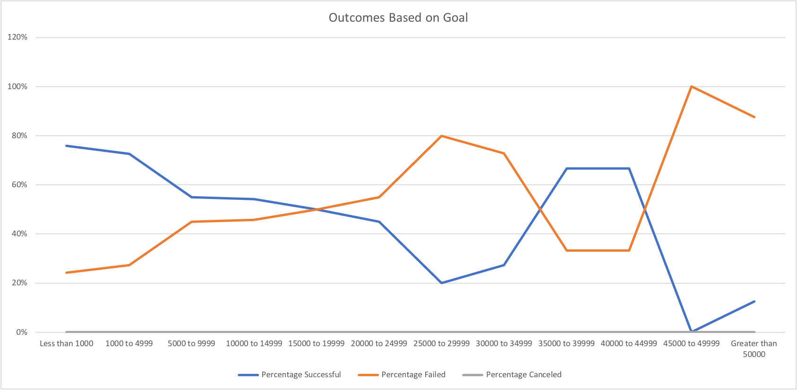

# Kickstarting with Excel

## Overview of Project
 

### Purpose of the Analysis 
Louise is planning a fundraising campaign for her play *Fever*. In order to help Louise achieve the goal of her campaign, analysis is done on the dataset of Kickstarter to provide insights and guidance. The purpose of this analysis on the Kickstarter dataset is to achieve the following:
1. Find how different the compaigns outcomes are based on their launch dates
2. Find how different the compaigns outcomes are based on their funding goals

 

## Analysis and Challenges

### Analysis of Outcomes Based on Launch Date
--- 

From Kickstarter data sheet, a Pivot Table was created with the following setup:
* Fields selected for Filters: Parent Category, Year
* Fields selected for Columns (Legend): Outcomes
* Fields selected for Rows (Axis): Date Created Conversion (Years and Quarters taken out)
* Fields selected for Values: Count of outcomes

Pivot Chart shows below in accordance to the above Pivot Table:

### Analysis of Outcomes Based on Goals
---

From Kickstarter data sheet, data needed was extracted for the second analysis. Firstly a new sheet is created with goal funding devided into ranges of numbers (such as Less than 1000, 1000 to 4999, etc.). Within each range of the funding goals, COUNTIFS function is used to count the number of projects with the subcategory of "Plays" that's been successful, failed and canceled. In another column, total projects are added up using SUM function. Then, seperate columns were created to calculate the percentage of successful, failed, and canceled plays within each funding goal range (e.g. for funding goal between $5,000 to $10,000, there are 55.03% plays project ended successful, followed by 44.97% that's failed, and there has been no play that's canceled).  

Pivot Table were created with the above extracted data, the set up of the pivot table is as follows:
* Fields selected for Rows (Axis): Goal
* Fields selected for Values: Percentage Successful, Percentage Failed, Percentage Canceled
* Fields defaulted for Columns (Legend): Values

Pivot Chart shows below in accordance to the above Pivot Table:

### Challenges and Difficulties Encountered
---
1. When trying to sort the range of numbers in the Pivot Table for the Outcomes Based on Goals analysis, I failed to have the list sorted in the order of "Less than 1000" followed by "1000 to 4999", followed by "5000 to 9999", and so on. It's the mix of the letters and numbers in one cell that causes the issue. I then created a custom list in excel to have the issue resolved.
2. I had an issue with my Outcomes Based on Goals Pivot Chart looking differently than the one provided in the instructions. With the help of slack class1 channel, I was able to collaborate with peers, and find the root cause of the discrepancy. It turned out to be that one piece of requirement was missed in my extracted data for the Pivot Table I created. I added the criteria to my COUNTIFS function to have the data included with subcategory as "Plays" only from the Kickstarter dataset.

## Results
Based on the Theater Outcomes by Launch Date graph, it is clear that theater projects that's been successful has topped among the three outcomes (successful, failed, canceled), where the number of the failed campaigns are on average half of the number of the campaigns that's successful, with only few compaigns canceled throughout the year. And during the month of May to June in a year, it has the highest numbers of successful theater compaigns. 

Based on Outcomes Based on Goals graph, among all the *Plays* category compaigns, there is no canceled play. The lowest funding goals result in the highest percentage in sucess in terms of the outcome. The highest funding goals, on the opposite, have the lowest success percentage in terms of the outcomes.

Apart from the analysis that's completed above, the limitations of the dataset should be considered as well. The dataset used for the analysis could be imcomplete with values missing. The quality and accuracy of the data needs to be brought to attention when performing analysis. When analyzing the data, outliers should be excluded to avoid too much of a skewed data. If possible, a table/graph should be added to show how skewed the data is by including the mean, median, standard deviation on the numbers of projects that's been successful, failed, canceled in different funding goal range to gain a better view of the central tendency and the spread of the data in the campaigns that's been focused on.