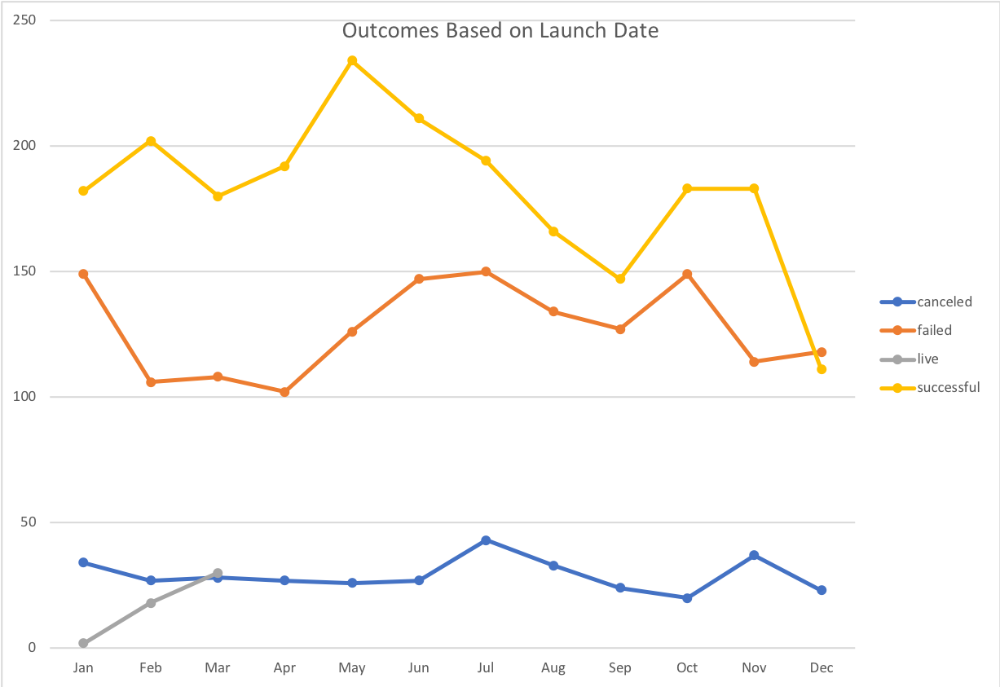

# An Analysis of Kickstarter Campaigns
Louise is thinking about launching a compaign and hoping that Kickstarter data can provide some insights for her own compaign and have a successfully result. Data analysis was performed on the data shown in the excel sheets to uncover the hidden trends among nearly four thousand crowdfunding projects. Please see below the analysis with graphs and the recommendations for Louise.

* May and June both have a greater success rate

* Funding information for the plays of Louise's interest

* Box Plot for finalize campaign decision for Louise

Based on the above analysis and graphs, we take out the outliers in the Box Plot top dots for both Goal and Pledged, then compare the blue and orange bar and come to a conclusion: Louise should try to get her play produced for less than £4,000. Half of the campaign goals are less than £2,000, which is just over the 3rd quartile for amounts pledged.
